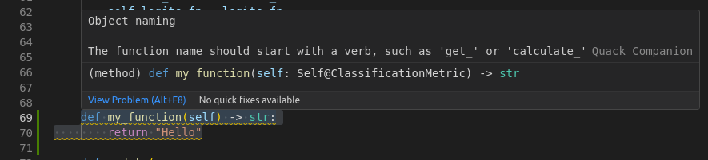
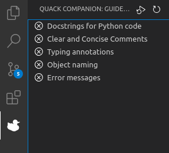
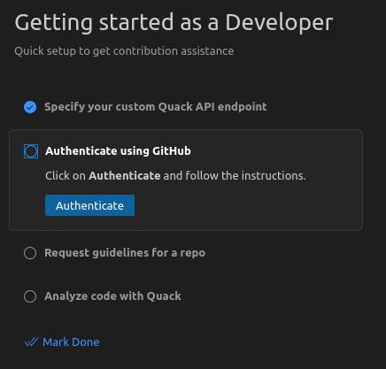

  

<h1 align="center">
 Quack Companion
</h1>

  <a href="https://github.com/quack-ai/companion">VSCode extension</a> ・
  <a href="https://github.com/quack-ai/contribution-api">Backend API</a> ・
  <a href="https://github.com/quack-ai/platform">Frontend dashboard</a> ・
  <a href="https://docs.quackai.com">Documentation</a>

<h2 align="center"></h2>

  
  
  
  

  
  
  
  

  <!--  -->
  
  

This extension guides you through your code contributions with Quack as a companion. The extension provides curated contribution guidelines from maintainers and assists you in meeting them.

## Quick Tour

### Contribution guidance

Once installed, when you open a public GitHub project, the extension will give you a new tab wher you'll find:

- **Guidelines**: automatic compliance of contribution guidelines, so that you can avoid the back-and-forth between the PR reviews and your IDE!
- **Code chat** (coming soon)

### Walthrough tutorial

With our walkthrough tutorial, you're only a few clicks away from having your own coding companion.

## Setup

### Prerequisites

Install [VSCode](https://code.visualstudio.com/Download)

### Install the extension

Either:

- Follow the instructions on the online [VS Marketplace page](https://marketplace.visualstudio.com/items?itemName=quackai.quack-companion)
- In VSCode, click on Extensions in the sidebar, search for "Quack Companion" and click on "Install"

## Roadmap

The ultimate goal for this extension is to offer a smooth contribution experience for any developer.
The development efforts will be focused on achieving the following milestones:

- 🤝 Turn contribution guidelines into a live pair coding experience (code completion & code chat)
- 🐣 Help any developer find a starter contribution opportunity
- ⚖️ Ensure alignment between the contribution goal and the project's priorities

## Telemetry

### Why we collect information

Quack is dedicated to transform the contribution workflow of developers. Developer tools are among the most difficult types of product to build and we need to better understand where to allocate/reduce our efforts over time.

Since we want to keep providing free options for our services in the future, and since we don't want to rely on advertising, we humbly ask you to share limited usage data so that we can improve the products and services that we offer.

### What we collect

For each event, here is the largest amount of data we collect:

- Event identifiers: the event type (e.g.`fetch-guidelines`) and potentially the scope (e.g. the repository)
- User information: depending on the telemetry setting, either your GitHub username or an anonymized UUID specific to you (created when you first activate the extension).

And since the extension is open source, you can navigate the codebase to verify the above information if you feel like it ;)

### What you can do about it

This data collection is done using [Posthog](https://posthog.com/) and can be:

- 😟 anonymized: by default we'll identify your actions with your GitHub username. We'll keep an option to prevent that identification, as we understand it's important for developers to have this choice.
- 😭 disabled: like in most VSCode extensions, you have the ability to disable telemetry completely.

## Copying & distribution

Copyright (C) 2023-2024, Quack AI.

This program is licensed under the Apache License 2.0.
See LICENSE or go to <https://www.apache.org/licenses/LICENSE-2.0> for full license details.

## Contributing

Feeling like improving the interface? Or perhaps submitting a new feature idea? Any sort of contribution is greatly appreciated!

You can find a short guide in [`CONTRIBUTING`](CONTRIBUTING.md) to help grow this project! And if you're interested, you can join us on 
